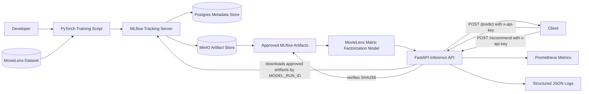

# Lumina Rec Architecture

## Purpose

Lumina Rec is a local MLOps recommendation system that demonstrates model training, experiment tracking, artifact storage, containerized inference, observability, and security controls.

The current model is a MovieLens matrix factorization recommender trained on the MovieLens latest small dataset.

## Current Approved Model

| Field | Value |
|---|---|
| Model name | lumina-rec-movielens-mf |
| Model version | 0.2.0 |
| Dataset | MovieLens latest small |
| Model type | Matrix factorization |
| MLflow run ID | 14eda4cf03bd4d328a3ee791ec9a002f |
| Artifact path | approved_model |
| Model SHA256 | 205de2403fdd84e1826dbde3e2f52470e36198d7c4f4953a5e0118e3040b14cd |
| Test RMSE | 2.0162 |

## Architecture Diagram



## Training Flow

The training workflow:

1. Downloads the MovieLens latest small dataset.
2. Trains a PyTorch matrix factorization recommender.
3. Logs parameters and metrics to MLflow.
4. Saves the approved model artifact.
5. Logs model metadata, mappings, and movie metadata to MLflow.
6. Records the model SHA256 checksum.

## Inference Flow

The inference service:

1. Reads `MODEL_RUN_ID`.
2. Connects to MLflow.
3. Downloads artifacts from the `approved_model` path.
4. Loads `recommender_model.pt`.
5. Loads `model_metadata.json`.
6. Loads `movielens_mappings.json`.
7. Verifies the model SHA256 checksum.
8. Serves rating predictions through `/predict`.
9. Serves top N recommendations through `/recommend`.

## Local Services

| Service | Role | URL |
|---|---|---|
| FastAPI Inference | Serves MovieLens rating predictions and recommendations | http://localhost:8001 |
| MLflow | Tracks experiments and approved model artifacts | http://localhost:5000 |
| MinIO | Stores MLflow artifacts | http://localhost:9001 |
| Postgres | Stores MLflow metadata | localhost:5433 |
| Redis | Future cache and queue support | localhost:6379 |
| Keycloak | Future identity provider | http://localhost:8082 |
| LocalStack | Future AWS local testing | http://localhost:4566 |

## Inference API

The inference API exposes:

| Endpoint | Purpose | Protection |
|---|---|---|
| GET /health | Confirms service is running | Open locally |
| GET /ready | Confirms approved MLflow model artifact is loaded | Open locally |
| GET /metrics | Exposes metrics | Open locally |
| POST /predict | Predicts a MovieLens rating | Requires API key |
| POST /recommend | Returns top N movie recommendations | Requires API key |

## Prediction Request

```json
{
  "user_id": 1,
  "movie_id": 1
}
```

## Prediction Response

```json
{
  "predicted_rating": 5.0,
  "user_id": 1,
  "movie_id": 1,
  "model_name": "lumina-rec-movielens-mf",
  "model_version": "0.2.0",
  "request_id": "example-request-id",
  "latency_ms": 0.67
}
```

## Recommendation Request

```json
{
  "user_id": 1,
  "top_n": 10
}
```

## Recommendation Response

```json
{
  "user_id": 1,
  "recommendations": [
    {
      "movie_id": 2,
      "predicted_rating": 5.0
    },
    {
      "movie_id": 3,
      "predicted_rating": 5.0
    }
  ],
  "model_name": "lumina-rec-movielens-mf",
  "model_version": "0.2.0",
  "request_id": "example-request-id",
  "latency_ms": 3.83
}
```

## Security Controls

Current controls include:

- API key authentication for `/predict`
- API key authentication for `/recommend`
- Input validation with Pydantic
- Unknown user and movie rejection
- Bounded `top_n` recommendation size
- Configurable rate limiting
- Model checksum validation
- Approved model loading through MLflow
- Structured JSON logs
- Prometheus metrics
- Secret scanning in CI
- Container vulnerability scanning in CI
- Dockerized inference runtime
- `.env` excluded from Git

## Observability

The system exposes:

- Request count
- Prediction error count
- Prediction latency
- Rate limit error count
- Structured logs with request ID
- Model checksum status from `/ready`
- Model run ID from `/ready`
- Artifact path from `/ready`

## Model Integrity

The inference service calculates SHA256 for the approved model artifact.

If `MODEL_SHA256` is set and does not match the downloaded MLflow artifact, the service fails startup.

Current approved checksum:

```text
205de2403fdd84e1826dbde3e2f52470e36198d7c4f4953a5e0118e3040b14cd
```

## Local Validation

The current stack has validated:

- MovieLens training completed
- MLflow run logged
- Approved artifacts stored in MinIO
- Inference service downloaded approved artifacts
- `/health` passed
- `/ready` passed
- `/predict` passed with `user_id` and `movie_id`
- `/recommend` passed with `user_id` and `top_n`
- `/metrics` passed
- API tests passed
- Load test passed with zero failures

## Future Architecture Improvements

- Add movie title and genre metadata to recommendation responses
- Add `/movies/{movie_id}` lookup endpoint
- Add MLflow Model Registry alias for approved model selection
- Add dataset checksum validation
- Add signed artifact verification
- Add Feast feature store workflow
- Add JWT based authentication
- Restrict metrics to internal monitoring
- Add Grafana dashboard
- Add production cloud deployment path